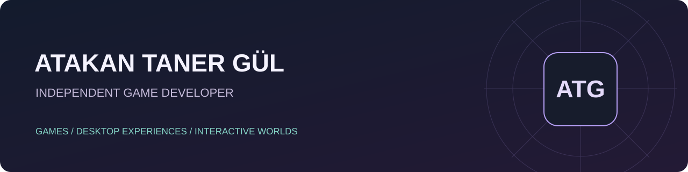

<b>Independent game developer · Crimson Smile Games</b> Games with character. Systems with consequences. Small worlds worth exploring.

 

## Hi, I'm Atakan.

I build independent games and interactive desktop experiences. My projects explore meaningful choices, management systems, and characters that make a world feel alive.

My work ranges from medieval investigations and fantasy guilds to a tiny hunting adventure above the taskbar and a companion that lives on your desktop.

## Selected projects

| Project | What I'm building | Development status |
| :--- | :--- | :--- |
| **[Seal & Sentence](https://github.com/AtakanTGul/seal-and-sentence)** | A medieval border-inspection game about documents, difficult decisions, and the people behind them. | In development · Steam page live |
| **[PIKO: Desktop Buddy](https://github.com/AtakanTGul/piko-desktop-buddy)** | An interactive desktop companion with expressive behavior, window interactions, and everyday company. | In development · Working prototype |
| **[HUNTKEEPER: Idle Trails](https://github.com/AtakanTGul/huntkeeper-idle-trails)** | A compact desktop idle hunting game featuring a hunter, a dog, and a growing collection of adventures. | In development · Playable prototype |
| **[Death Auditor](https://github.com/AtakanTGul/death-auditor)** | A gothic investigation game about examining death orders, weighing evidence, and passing judgement. | In development · Playable prototype |
| **[Adventurer's Guild](https://github.com/AtakanTGul/adventurers-guild)** | A fantasy guild-management game built around recruitment, expeditions, and life inside a growing guild. | In development · Vertical slice |
| **[RUMOR BROKER](https://github.com/AtakanTGul/rumor-broker)** | A social strategy game about information, reputation, and the consequences of a spreading rumor. | In development · Playable prototype |

### Follow Seal & Sentence

A kingdom's border. A desk full of papers. A decision that belongs to you.

[**View the Steam page →**](https://store.steampowered.com/app/5050730/Seal_Sentence/)

## What I work with

**Unity · Godot · C#**  
Gameplay systems, desktop interaction, progression, investigation, and management experiences.

## Merhaba, ben Atakan.

Bağımsız oyunlar ve etkileşimli masaüstü deneyimleri geliştiriyorum. Kararların sonuçlarını hissettiren oyunlar, yaşayan karakterler ve yönetim sistemleri üzerinde çalışıyorum.

Yukarıdaki projeler **geliştirme aşamasındadır**. Bu profil ve bağlantılı depolar projelerimi tanıtmak içindir; kaynak kodları ve üretim dosyaları paylaşılmaz.

---

Portfolio and project showcases only. Source code is not publicly distributed. Project names and descriptions may evolve during development.
